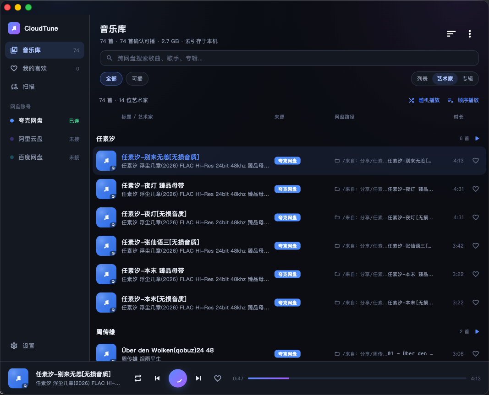
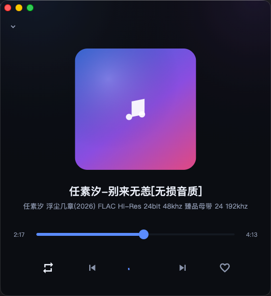
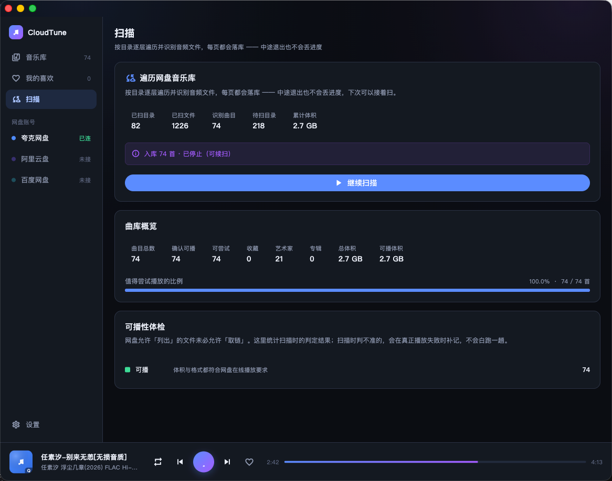
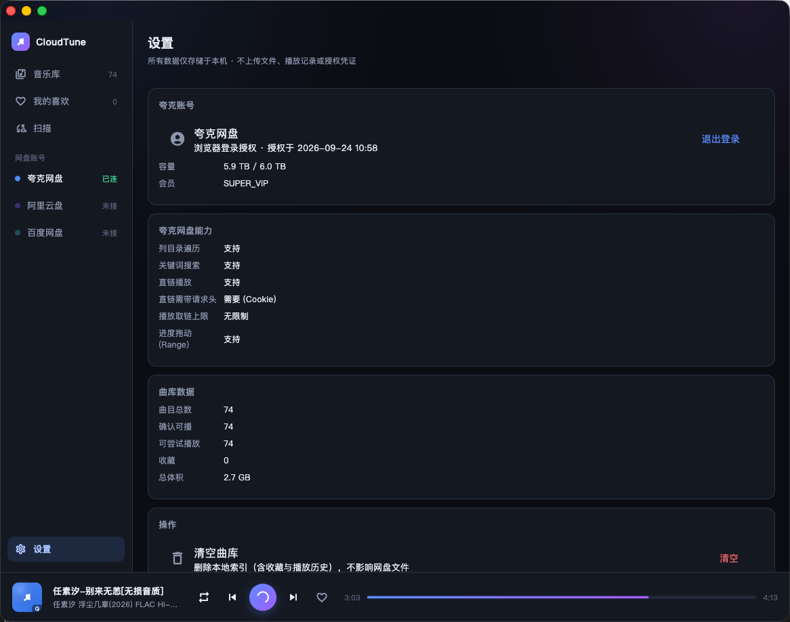

<div align="center">

# CloudTune · 云韵

**把你散落在网盘里的音乐，变成一个能直接播的音乐库**

不下载 · 不搬家 · 不建后端

[](LICENSE)
[](https://flutter.dev)
[](#平台支持)
[](https://github.com/tanchang03/cloudtune/actions/workflows/ci.yml)

</div>

---

> ⚠️ **使用前请先读 [法律声明](DISCLAIMER.md)。**
>
> 本项目是**第三方独立开源客户端**，与夸克、阿里云盘、百度网盘官方**均无关联，未获其授权或认可**。
> 仅供播放**你自己账号下、你有合法访问权**的文件。使用第三方客户端**可能违反网盘服务协议并导致账号受限**，
> 该风险由使用者自行承担。请勿用于账号共享、对外提供服务或任何商业化用途。

---

## 这是什么

你有没有过这种状态：几年攒下来的音乐躺在网盘里，几百上千首，想听的时候得先下载、解压、拖进播放器，还得自己整理目录名。

**CloudTune 把这些活儿全省了。** 它直接连你的网盘，把音乐文件扫成一个本地音乐库，点一下就在线播放 —— 文件始终留在网盘，不占本地空间。

它**没有服务端**。所有请求由客户端直接发往网盘接口，你的文件列表、播放记录、授权凭证全部只存在你自己的电脑上。

## 截图

| 音乐库 | 播放器 |
|---|---|
|  |  |
| 艺术家分组、可播性徽标、来源与网盘路径一目了然 | 全屏播放页，大封面 + 进度拖拽 |

| 扫描 | 设置 |
|---|---|
|  |  |
| 逐层遍历、断点续扫、扫描后给出曲库体检 | 账号状态、网盘能力探测、曲库数据、清空曲库 |

## 核心特性

| 特性 | 说明 |
|---|---|
| **扫码登录** | 用夸克 App 扫一下即可授权，**全程不接触账号密码**。也支持官方登录页与手动粘贴 Cookie |
| **在线直连播放** | 不下载文件，边播边拉。支持拖动进度条（HTTP Range 断点请求） |
| **逐层遍历扫描** | 按目录递归识别音频文件，每页结果都会落库 |
| **断点续扫** | 中途退出、关掉应用都不丢进度，下次接着扫 |
| **CUE 分轨** | 专辑自带的 `.cue` 分轨表会被读进来：整轨 WAV/FLAC 切成一首首能点、能收藏、能随机的歌；多文件专辑则用 CUE 里的曲名/艺术家/专辑覆盖文件名推断 |
| **可播性预判 + 体检** | 扫描时就判断哪些文件能播，并在曲库里解释**为什么不能播、需要什么条件** |
| **失败自动跳过** | 遇到播不了的文件自动切下一首，不会卡住整个播放流程 |
| **随机播放（少听优先）** | 加权随机：听得少的歌更容易被抽到，24 小时内听过的权重降到 0.2，不会总在几首里打转 |
| **顺序播放** | 严格按当前列表顺序走 |
| **艺术家 / 专辑分组** | 从文件名与目录名推断，自动聚合 |
| **搜索与来源筛选** | 跨盘搜索歌曲、歌手、专辑；按「全部 / 可播」筛选 |
| **收藏** | 喜欢列表独立于网盘，纯本地 |
| **诊断日志** | 内置日志页，出问题能直接看到原始异常（见 [排查](#出问题了怎么办)） |
| **数据全本地** | 不上传文件、不上传播放记录、不上传授权凭证 |

## 平台支持

| 平台 | 状态 |
|---|---|
| **macOS** | ✅ 主要目标，已实测 |
| Windows / Linux | ⚠️ 代码已适配（`just_audio_windows` / `media_kit`），但**未实测** |
| Android / iOS | ⚠️ 工程骨架在，**未实测** |
| Web | ❌ 不可用。浏览器 CORS 限制导致无法直连网盘播放地址 |

网盘支持情况：

| 网盘 | 状态 |
|---|---|
| **夸克网盘** | ✅ 已接入。支持列目录遍历、关键词搜索、直链播放 |
| 阿里云盘 | 🚧 规划中 |
| 百度网盘 | 🚧 规划中 |

> 目前是**单网盘**实现。架构上已经把「网盘适配器」抽成接口（`lib/domain/adapters/`），接入新网盘不需要动上层。

## 安装

### 系统要求

| 项目 | 要求 |
|---|---|
| macOS | **11 (Big Sur) 或更高** |
| 处理器 | Apple Silicon 与 Intel 均可（安装包是通用二进制） |
| 其它 | 无。不需要装任何运行时，也不依赖服务端 |

### 方式一：下载安装包（推荐）

到 [Releases](https://github.com/tanchang03/cloudtune/releases) 下载最新的 `cloudtune-x.y.z-macos.dmg`，
双击打开，把 **CloudTune** 拖进「应用程序」窗口。也有 `.zip` 版本可选（解压后同样是拖进「应用程序」）。

> **安装包没有做 Apple 公证**（公证需要每年 99 美元的付费开发者账号），所以**首次打开一定会被
> Gatekeeper 拦住**，提示「无法验证开发者」或「Apple 无法验证…是否包含可能危害 Mac 安全或泄漏隐私的恶意软件」。
>
> **这不是中毒，也不是安装包损坏**，是未公证应用的正常待遇。按下面「按系统版本操作」做一次即可，
> 之后就能正常双击启动了。**请不要删除应用。**

#### 首次打开：按你的 macOS 版本操作

**macOS 26 (Tahoe) 及以上**

系统**已经移除**了「右键 → 打开」这条旁路，隐私与安全性里也可能**不出现**「仍要打开」按钮 ——
所以网上流传的老办法在这里不管用，不是你没找到按钮。

打开「终端」，执行一次：

```bash
xattr -rd com.apple.quarantine /Applications/cloudtune.app
```

然后双击应用即可。

这条命令只做一件事：删掉「这个文件来自网络」的标记。没有这个标记，系统就不会在首次启动时
去做那次安全评估。**应用本体没有被改动**，可以用下面这行自行校验 bundle 完好：

```bash
codesign --verify --deep --strict /Applications/cloudtune.app
# 期望输出：valid on disk / satisfies its Designated Requirement
```

**macOS 15 (Sequoia)**

在「应用程序」里**右键点 CloudTune → 打开**，弹窗里再点一次**打开**。
右键无效时，去 系统设置 → 隐私与安全性 → 安全性，点「仍要打开」。

**macOS 14 及更早**

右键点 CloudTune → 打开 → 再点「打开」。

#### 不想敲命令？两个替代方案

**方案 A：系统级放行**（全局生效，会降低整机安全等级）

```bash
sudo spctl --master-disable
```

然后**保持「系统设置」窗口开着**，先切到别的面板、再切回「隐私与安全性 → 安全性」，
这时才会出现「允许以下来源的应用程序」下拉框，选**任何来源**并输入密码确认。

> 这条设置对所有未公证应用都生效。不再需要时建议恢复：
> `sudo spctl --master-enable`

**方案 B：改用「方式二」从源码构建**

自己构建出来的产物**不带隔离标记，完全不会被拦**。如果你对下载来的安装包不放心，
这是最干净的一条路，代价是需要装 Xcode 与 Flutter。

### 方式二：从源码构建

```bash
git clone https://github.com/tanchang03/cloudtune.git
cd cloudtune
./build_macos.sh --release      # 不加 --release 则构建 Debug 包
```

前置条件：Flutter 3.29+、Xcode、CocoaPods。脚本会依次跑 `flutter pub get` → `pod install` → `flutter build macos`，产物在 `build/macos/Build/Products/Release/cloudtune.app`。

<details>
<summary>手动构建 & 两个容易踩的坑</summary>

```bash
export DEVELOPER_DIR=/Applications/Xcode.app/Contents/Developer
export PATH="/opt/homebrew/bin:$PATH"        # ← 坑 1
unset HTTP_PROXY HTTPS_PROXY http_proxy https_proxy ALL_PROXY all_proxy
export no_proxy=127.0.0.1,localhost          # ← 坑 2

flutter pub get
(cd macos && pod install)
flutter build macos --release
```

**坑 1：CocoaPods 不在 PATH 里，构建会被静默跳过。**
`flutter build macos` 找不到 `pod` 时只会打印一行 `CocoaPods not installed`，然后**以退出码 0 结束，产物还是上一次的旧包**。看起来「构建成功」，实际什么都没做。所以务必先 `which pod` 确认。

**坑 2：代理会让 Dart 的 WebSocket 连不上。**
`flutter run` / `flutter test` 在有 `HTTP_PROXY` 时会报 502 或 `WebSocketException: Invalid WebSocket upgrade request`。构建原生 macOS 包本身不需要代理，直接 `unset` 掉最省事。

**签名**：仓库默认用 **ad-hoc 签名**，不包含任何开发者的证书名或 Team ID，所以任何人 clone 下来都能直接构建，不需要付费开发者账号。

想生成**能分发给别人**的包，需要用自己的 Developer ID 证书。把 `macos/Runner/Configs/Signing.local.xcconfig.example` 复制成同目录下的 `Signing.local.xcconfig` 并填上证书名与 Team ID 即可（该文件已被 `.gitignore` 排除，不会进仓库）。也可以直接：

```bash
./build_macos.sh --release <你的TeamID>     # 自动查本机证书并生成本地签名配置
```

**如果卡在签名**：用 Xcode 打开 `macos/Runner.xcworkspace`，选 Runner / My Mac，按 ▶ Run。Xcode 会引导你用免费 Apple ID 完成签名，不需要付费开发者账号。

</details>

### 安装后常见问题

<details>
<summary>提示「CloudTune 已损坏，无法打开。你应该把它移到废纸篓」</summary>

**别删。** 这跟「无法验证开发者」是同一件事 —— 未公证 + 文件来自网络，
只是系统换了句话术。按上面「按你的 macOS 版本操作」清一次隔离标记即可。

</details>

<details>
<summary>双击没反应，或图标在 Dock 里闪一下就消失</summary>

说明进程起来了但立刻退出了，通常是取链或登录态的问题。看日志（见[出问题了怎么办](#出问题了怎么办)）：

```
~/Library/Application Support/com.cloudtune.cloudtune/logs/cloudtune-YYYY-MM-DD.log
```

</details>

<details>
<summary>每次启动都要重新登录网盘</summary>

凭证存系统钥匙串，首次写入时系统会弹窗询问。**如果当时点了「拒绝」**，应用会静默降级到
「只存在内存里」，于是每次启动都要重登。

打开「钥匙串访问」，搜索 `cloudtune`，删掉相关条目，重启应用重新登录并在弹窗里选**始终允许**。

</details>

<details>
<summary>某些曲目播不了 / 播到一半自动跳下一首</summary>

这是设计行为：遇到播不了的文件会**自动跳过**而不是卡住整个播放流程。
原因分几类，列表里的可播性徽标点一下会说明**为什么不能播**。
已知的格式限制见[已知限制](#已知限制)。

</details>

<details>
<summary>怎么确认安装包没被动过手脚</summary>

```bash
codesign --verify --deep --strict /Applications/cloudtune.app   # bundle 结构与签名是否完好
codesign -dv --verbose=2 /Applications/cloudtune.app            # 看签名者信息（本项目是 ad-hoc，无签名者）
spctl -a -vvv -t exec /Applications/cloudtune.app               # 看 Gatekeeper 的判定（未公证必然 rejected）
```

最稳妥的做法是从源码自己构建 —— 见「方式二」。

</details>

## 使用流程

1. **登录网盘** —— 左侧栏点「夸克网盘」→ 点**扫码登录**，用夸克 App 扫一下就行，
   全程不接触账号密码。不想用手机也可以选「浏览器登录授权」在应用内弹出的官方登录页里登录，
   或者手动粘贴 Cookie 兜底。
   凭证只由应用自己的 WebView / 扫码链路取得，存进系统钥匙串，之后不用重复登录。
2. **扫描曲库** —— 左侧栏「扫描」→ 开始遍历。扫完会给出曲库概览：总曲目数、可播数、总体积、可播体积占比。
3. **开始听** —— 回到「音乐库」，点任意一首播放。可以切「列表 / 艺术家 / 专辑」三种视图，也可以用顶部搜索框跨盘搜歌。

> 网盘路径那一列**点一下会复制完整路径**，方便你回到网盘客户端里定位文件。

## CUE 分轨

网盘上的专辑常以「一整张碟一个 WAV 文件 + 一个 `.cue` 分轨表」的形式存放 ——
这种文件在普通播放器里只能整张连着放，跳不到第 7 首，也收藏不了单曲。
CloudTune 在扫描时会顺带把 `.cue` 读进来，让它们变成正常的曲目。

**两种目录，两种处理：**

| 目录形态 | 处理方式 |
|---|---|
| 一张整轨 + 一个 `.cue`（1 个 `FILE`、N 个 `TRACK`） | 按 CUE 的时间码**切成 N 首虚拟曲目**，每首都有自己的曲名、时长、收藏和播放次数；整轨那一行会被它切出的歌取代 |
| 多个独立文件 + 一个 `.cue`（N 个 `FILE`） | 曲目结构不动，只用 CUE 里的 `TITLE` / `PERFORMER` 覆盖文件名推断出的曲名与艺术家 —— 抓轨的 CUE 比文件名准 |

**界面上怎么体现**（CUE 本身不喧宾夺主，只体现在专辑的组头上）：

- 组头多一个金色标记 `WAV · CUE 分轨`，以及一个**「整轨连播」**入口；
- 组内的每一行都是**普通曲目行** —— 只是前面多了一列来自 CUE 的轨号（`01`、`02`…），
  因为整轨文件名推不出这是第几首；
- 「整轨连播」按原样把整轨文件当成一首连续播放，**不按 CUE 切轨**。切轨点是推算出来的，
  遇到不准的 CUE 或现场专辑那种本来就无缝衔接的录音，这是你按原样听整张的退路。

**几个细节：**

- **编码**：中文抓轨的 CUE 很多是 GBK 编码。读取时先严格按 UTF-8 解，解不开自动退回 GBK，所以两种都不会变乱码。
- **单轨时长**：来自 CUE 里相邻两轨的时间码差值；码率与体积则按整轨折算（拿整轨体积除以单轨时长会算出离谱的数）。
- **CUE 是锦上添花**：读不到、解析失败、或网盘不支持读取文件内容时，只让这个目录退回「没有 CUE」的样子，**绝不会影响整次扫描**。

## 已知限制

这些是**当前真实存在**的限制，不是 bug：

### 1. 夸克的取链接口是未公开的，可能随时失效

播放取链走的是 `drive-pc.quark.cn` 下的 `/1/clouddrive/file/audioplay` —— 这是从官方客户端里逆向出来的**未公开路由**，不是官方开放平台接口。

好消息是它**不受体积限制**：实测 774MB 的整轨 WAV 照样能取到原文件直链，库里 195 首超过 50MB 的曲目按体积降序抽样 40 首**全部可播**。

那条常被提到的「约 50MB 单文件上限」只存在于 `/1/clouddrive/file/download` 这条**兜底**路由上 —— 它是 PC 网页版「下载」这条产品路径的限制，跟会员等级无关（SUPER_VIP 账号同样触发 `code=23018`）。本应用只在主路由失败时才回落到它，所以只有「主路由也取不到链」的曲目才会被标记为不可播。

代价是：**这条路没有契约保证**。夸克随时可能改参数、加签名或直接关掉它，届时大文件播放会失效，需要重新适配或改走官方开放平台（`open-api-drive.quark.cn`，目前仍在内测）。

> ⚠️ 使用未公开接口也可能违反服务协议，带来账号风险。请阅读 [法律声明](DISCLAIMER.md)。

### 2. DSD 格式在 macOS 上无法播放

`.dsf` / `.dff` 文件，macOS 的 AVFoundation 解码器不认。这是平台能力问题，需要换 `media_kit` 后端才能解决。

### 3. 部分文件时长显示 `--:--`

时长依赖网盘列表接口返回的 `duration` 字段。部分文件该字段缺失，且列表接口不返回码率/采样率，所以这类文件只能显示占位符。

> 音质品质是按**平均码率**推断的（`码率 = 字节数 × 8 ÷ 毫秒数`），不是从网盘元数据读的。网盘不提供这些信息。

### 4. CUE 分轨只在同一个目录内生效

CUE 里的 `FILE` 是相对它**自己所在目录**的文件名，所以 `.cue` 必须和音频放在一起。
跨目录引用（`FILE "../CD1/image.wav"`）不会被解析 —— 那样匹配只会误伤别的专辑。

另外两个已知边界：

- **分轨点完全来自 CUE 里的时间码**。CUE 本身不准，切出来的歌就会偏（表现为上一首末尾多几秒、
  或某首开头被削掉）。这种情况用组头的「整轨连播」按原样听整张。
- **续扫可能漏掉某个目录的 CUE**。CUE 要等「这个目录的音频都扫完」才能按文件名对上，
  如果上次扫描正好停在某个目录中间、这次从断点接着扫，那个目录这次可能对不上。
  不会产生错误数据，下次完整扫一遍就修正了。

### 5. 阿里云盘 / 百度网盘尚未接入

见 [平台支持](#平台支持)。

## 它是怎么工作的

**核心设计原则：纯客户端直连，没有自建后端。** 这不是技术偏好，而是合规硬约束 —— 任何形式的中转服务器都会让「用户的文件经过第三方」成立。

```
┌────────────────────────────────────────────────┐
│  表现层    Flutter Widgets · go_router         │
│            音乐库 / 播放器 / 扫描 / 设置       │
├────────────────────────────────────────────────┤
│  应用层    Riverpod Providers / Notifier       │
├────────────────────────────────────────────────┤
│  领域层    Track · Playability · CueIndexer    │
│            PlaybackController · 纯 Dart，无 IO │
├────────────────────────────────────────────────┤
│  数据层    DriveAdapter 接口                   │
│            └── QuarkAdapter（夸克实现）        │
│            HTTP(dio) · 本地索引(drift/SQLite)  │
│            凭证(系统钥匙串)                    │
└────────────────────────────────────────────────┘
                        │
                        ▼  直接请求，无中转
              夸克网盘接口 / 音频直链
```

一个播放请求的完整链路：

```
选歌 → 从钥匙串取 Cookie → 换取带签名的直链(ticket)
     → 交给 just_audio 播放 → 播不动就回探直链拿状态码
     → 分不清是「链接坏」还是「解码器不认」时，日志会告诉你
```

扫描时还会顺带处理目录里的 `.cue` 分轨表：

```
遇到 .cue → 取原始字节（先按 UTF-8 解，失败退回 GBK）
          → 解析时间码（MSF，75 帧/秒）
          → 整轨切段 / 分轨补元数据
          → 与普通曲目写进同一张表，收藏、随机、搜索照旧可用
```

分轨信息是**在扫描时落进本地索引库的**，不是查询时现算 —— 所以切出来的每一首歌都有自己的行，
收藏、播放次数、随机权重、搜索全都照旧工作，上层完全不知道它是虚拟曲目。

CUE 同时是**只增不减的旁路**：读不到、解析失败、网盘不支持读取文件内容，都只让这个目录退回
「没有 CUE」的样子，不会让扫描失败，也不会产生错误数据。

## 出问题了怎么办

**设置 → 排查 → 诊断日志**，能直接看到带原始异常堆栈的日志，也可以一键复制全部。

日志已经做了脱敏：签名直链只保留 `scheme + host + path`，请求头只记录键名，Cookie 值全部打码。可以直接贴到 issue 里。

日志文件位置（macOS）：

```
~/Library/Application Support/com.cloudtune.cloudtune/logs/cloudtune-YYYY-MM-DD.log
```

## 开发

```bash
flutter pub get

# 静态分析
flutter analyze

# 全部单元测试（963 个）
flutter test

# 单个文件
flutter test test/domain/playability_resolver_test.dart
```

改完代码跑测试是硬要求 —— 领域层（`lib/domain/`）是纯 Dart、无 IO 的，可测性刻意做得很高，改动应该配套测试。

CI 会在每次 push 到 `main` 和每个 PR 上自动跑 `flutter analyze` + `flutter test`；打 `v*` tag 会自动构建 macOS 安装包并发到 Releases。

项目结构：

```
lib/
├── core/          工具：诊断日志、脱敏、错误类型、音频格式识别、CUE 分轨表解析
├── data/          数据层
│   ├── audio/     播放器封装 + 直链回探
│   ├── auth/      凭证存储（钥匙串 + 内存降级）+ 扫码登录
│   ├── db/        本地索引库（drift / SQLite）
│   ├── http/      HTTP 客户端（限流、重试、脱敏日志、原始字节通道）
│   └── remote/    网盘适配器实现（quark/）
├── domain/        领域层：实体、服务（含 CUE 分轨）、适配器接口（纯 Dart，无 IO）
├── ui/            界面：页面、组件、主题、路由
└── main.dart
docs/              需求分析、技术架构、设计审计三份设计文档
tool/              开发期诊断脚本（只读探测，不属于应用运行时）
test/              单元测试
imgs/              README 用的截图
.github/workflows/ CI 与自动发布
```

## 路线图

- [ ] 接入阿里云盘（有正式开放平台，可完整递归遍历）
- [ ] 接入百度网盘
- [ ] 改用夸克官方开放平台，摆脱对未公开路由的依赖（目前仍在内测，需申请资格）
- [ ] DSD 支持：换 `media_kit` 音频后端
- [ ] 歌词
- [ ] 播放列表 / 自建歌单
- [ ] 简体繁体归一化（让 `林忆莲` 与 `林憶蓮` 合并为同一艺术家）

## 贡献

Issue 和 PR 都欢迎。提交 PR 前请确保 `flutter analyze` 无警告、`flutter test` 全绿。

遇到播放问题请**附上诊断日志**（设置 → 排查 → 诊断日志 → 复制全部），日志里的原始异常比任何描述都准确。

## 法律声明

**本项目是第三方独立开源客户端，与夸克、阿里云盘、百度网盘官方均无关联，未获其授权或认可。**

- **仅限自用** —— 只用于播放**你自己账号下、你有合法访问权**的文件。
- **不破解、不绕过** —— 未破解任何加密存储，未规避任何付费、会员或权限控制。50MB 限制如实呈现给用户，不作为规避对象。
- **不提供内容** —— 不缓存、不转码、不分发、不提供对外分享能力。
- **没有服务器** —— 客户端直连网盘接口，项目**不存在任何中转**。凭证只存本机钥匙串，文件列表与播放记录只存本机。
- **不读取其它应用的数据** —— 凭证只从**本应用自己的** WebView 读取，不读浏览器 Cookie 库，不读系统钥匙串里其它应用的条目。
- **禁止**：使用他人凭证、账号共享、作为服务对外提供、商业化运营、分发未授权内容。
- **账号风险自担** —— 使用第三方客户端可能违反网盘服务协议，导致限流、功能受限或封禁。
- **接口可能失效** —— 部分端点为未公开接口，可能随时变更或关闭，本项目不承诺可用性。
- **无担保** —— 按 MIT 协议「按原样」提供，不附带任何担保。

完整条款（含商标声明、责任限制、权利人通知流程）见 **[DISCLAIMER.md](DISCLAIMER.md)**。

如你计划用于商业用途，请先咨询专业律师。

## 开源协议

[MIT](LICENSE) © 2026 tanchang03

选 MIT 是因为它**对使用者最友好**：任何人都可以自由使用、修改、商用、甚至闭源再发布，唯一的要求是保留版权声明。

这意味着：

- ✅ 你可以拿它改成自己的工具，不用公开改动
- ✅ 你可以打包分发给朋友
- ✅ 公司内部使用没有额外限制
- ❌ 作者不提供任何担保，出问题不承担责任

如果你打算把本项目用于商业产品，MIT 不需要你开源你的改动。

## English Summary

**CloudTune** is a Flutter desktop music player that turns your cloud drives into a playable music library — **no downloading, no re-uploading, no backend server**.

It scans your cloud drive folders, indexes the audio files into a local SQLite database, and streams them directly from the drive. Your file list, play history and credentials never leave your machine.

- **Features:** streaming playback with a draggable seek bar; incremental, resumable scanning; **CUE sheet support** — a single-image WAV/FLAC album plus its `.cue` becomes individual tracks you can play, favourite and shuffle, and multi-file albums get their titles, artists and album name from the `.cue` instead of filename guessing; playability pre-check with a per-track explanation of *why* something can't be played; weighted shuffle that favours rarely-played tracks; artist/album grouping; search across drives; local-only favourites; built-in diagnostics log.

- **Install:** requires **macOS 11 (Big Sur) or later** (universal binary, Apple Silicon + Intel). Download the `.dmg` from [Releases](https://github.com/tanchang03/cloudtune/releases), open it, and drag CloudTune into Applications. The build is **ad-hoc signed and not notarized**, so macOS **will block the first launch** — this is expected, not malware and not a corrupt download.
  - **macOS 26 (Tahoe) and later** — the right-click → Open bypass has been removed and the "Open Anyway" button may not appear. Run `xattr -rd com.apple.quarantine /Applications/cloudtune.app`, then launch normally.
  - **macOS 15 and earlier** — right-click the app → Open → Open again.
  - Building from source avoids this entirely (no quarantine flag). See the 安装 section above.
- **Status:** macOS is the supported and tested target. Quark Drive (夸克网盘) is the only integrated provider; Aliyun Drive and Baidu Netdisk are planned.
- **Design principle:** fully client-side. All requests go straight from the app to the drive APIs — there is no relay server, by design.
- **Not affiliated:** this is a third-party, non-commercial client. It is **not** affiliated with, authorized by, or endorsed by Quark, Aliyun Drive, or Baidu Netdisk. Playback uses an **undocumented endpoint** of Quark's own desktop client, which may change or stop working at any time — and using it may violate the provider's Terms of Service, with account risk borne by the user.
- **Credentials:** obtained by scanning a QR code with the Quark app — **no password is ever entered** — or from this app's **own** WebView after you sign in on the provider's official login page; stored in the local system keychain; never sent anywhere.
- **No circumvention:** no encryption is cracked and no paywall, membership, or permission control is bypassed. The provider's ~50MB single-file limit (on the fallback download route) is reported to the user as-is.
- **See [DISCLAIMER.md](DISCLAIMER.md)** for the full legal notice.
- **License:** MIT.

See the Chinese sections above for full documentation.

---

<div align="center">

**如果这个项目帮你省下了整理音乐的时间，欢迎点个 ⭐ Star**

</div>
